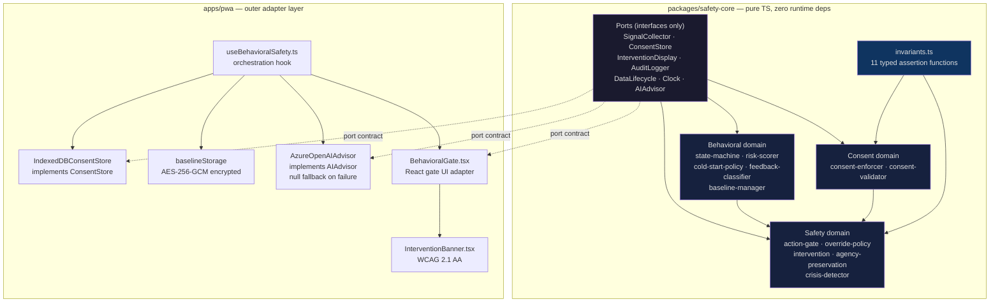
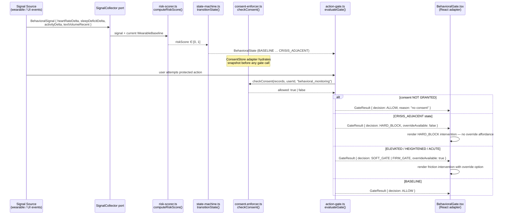
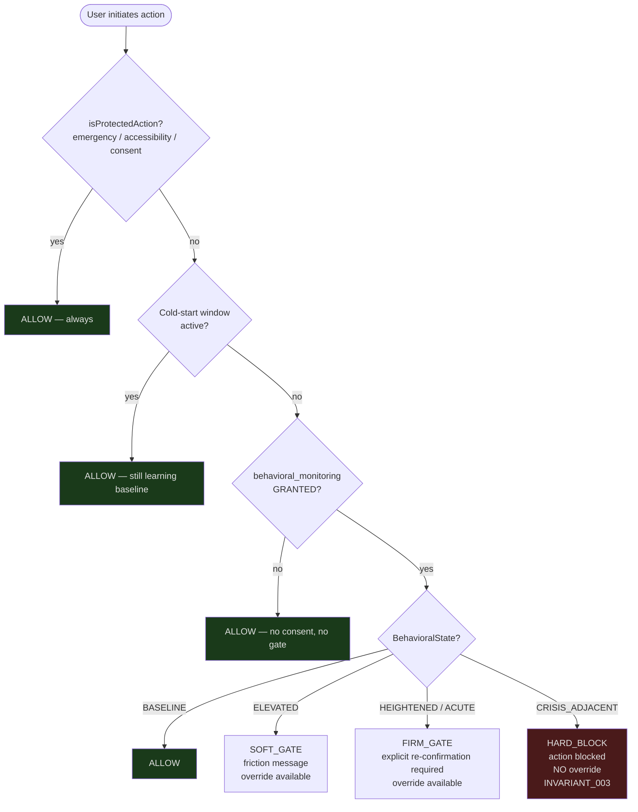

# UICare HUI — Behavioral Safety System

**A fail-safe Progressive Web App for high-risk neurodivergent users.**

Built to detect manic, compulsive, or destabilizing activity patterns before they
escalate into high-stakes actions — and to slow or block those actions during
elevated-risk periods through restrictive gates, local-first safety logic, and
consent-aware monitoring flows.

This is a behavioral safety aid. It is not a medical device. It does not diagnose
conditions. It does not replace emergency services or clinical support.

---

## Why this exists

High-risk neurodivergent users — people managing bipolar disorder, ADHD,
compulsive patterns, or co-occurring conditions — face a specific, under-engineered
problem: the moments when they are most likely to take catastrophic action (large
financial transactions, relationship-ending messages, irreversible account deletions)
are precisely the moments their judgment is most impaired and their self-awareness
lowest. Existing software has no concept of this. It just executes.

This system is an attempt to build software that knows the user's behavioral baseline,
recognizes deviation from it, and interposes proportional friction at the decision point
before the action completes. It does this offline, with explicit consent, without
claiming clinical authority, and without removing user agency — only slowing it.

---

## What it actually does (no overclaiming)

**Signal collection**
The `SignalCollector` port accepts typed behavioral signals: heart rate delta, sleep
deficit delta, activity level delta, and recent text volume. These are relative to the
user's own rolling baseline — not population norms. A signal is meaningless in isolation;
it matters only as deviation from that person's established pattern.

**Baseline management**
`updateBaseline()` in `risk-scorer.ts` uses Welford's online algorithm to maintain a
running mean across all three physiological dimensions. Updates are immutable: the
function returns a new baseline object, it never mutates in place. The original
`maniaService.ts` used module-level mutable state; that was a session-bleed risk and
has been corrected.

**Risk scoring**
`computeRiskScore()` produces a composite 0–1 score. Below 3 samples, it returns 0.0
— cold-start uncertainty is explicit, not papered over. Above that threshold:

  heartRate contribution  = max(0, hrDelta - baseline.hr) × 0.33
  sleep contribution      = max(0, sleepDelta - baseline.sleep) × 0.34
  activity contribution   = max(0, activityDelta - baseline.activity) × 0.33
  text volume overlay     = min(0.10, textVolumeRecent / 50,000)

Weights are direct from the original clinical-adjacent implementation in
`uicare-system`. They are not validated clinical thresholds. They are heuristics that
flag personal deviation, not disorder.

**State machine**
`transitionState()` maps risk score to one of five behavioral states with hysteresis
(±0.08) to prevent flapping. Downward transitions step one level at a time; upward
transitions are immediate if the score crosses a threshold. The state machine is a
pure function: same score + same current state = same output, every time.

```
State             Threshold   Gate imposed        Override?
─────────────────────────────────────────────────────────
BASELINE          < 0.25      ALLOW               N/A
ELEVATED          ≥ 0.25      SOFT_GATE           yes
HEIGHTENED        ≥ 0.50      FIRM_GATE           yes
ACUTE             ≥ 0.70      FIRM_GATE           yes
CRISIS_ADJACENT   ≥ 0.85      HARD_BLOCK          NO
```

**Action gate**
`evaluateGate()` is the decision point. It checks four rules in order:

  1. Is this a protected action (emergency exit, accessibility, consent flow)? → ALLOW always.
  2. Is cold-start observation window active? → ALLOW (gates suppressed, system still learning).
  3. Is behavioral_monitoring consent GRANTED? → if not, ALLOW (no consent, no gate).
  4. Apply STATE_GATE_MAP.

HARD_BLOCK produces a `GateResult` with `overrideAvailable: false`. There is no code
path that converts HARD_BLOCK to ALLOW once state is CRISIS_ADJACENT. This is
INVARIANT_003 and it is tested.

**Consent enforcement**
`checkConsent()` checks pre-loaded consent records. It never touches storage — that
is the IndexedDB adapter's responsibility. The core receives a snapshot; if
`behavioral_monitoring` is not GRANTED in that snapshot, gates do not fire. Period.
`applyRevocation()` returns a new record with REVOKED status; the adapter persists it.
There is no grace period, no retry, no "monitoring anyway while we wait."

---

## Architecture

Hexagonal (ports and adapters). The innermost hexagon is `packages/safety-core`.
It is pure TypeScript with zero runtime dependencies. Every external concern —
storage, UI, AI, clock — is represented by a port interface. The PWA implements
those ports as concrete adapters. The core does not know the PWA exists.



**Dependency direction is inward only.** `safety-core` never imports from `apps/*`
or any package that brings in React or browser APIs. This is enforced by ESLint
boundary rules at `.eslintrc.boundaries.js` — not by convention, by CI. A violation
blocks merge.

---

## Behavioral signal flow

The following sequence shows a complete cycle from signal ingestion to gate decision.
Every step maps to a real function in the codebase.



---

## Consent flow

Monitoring never activates without explicit consent. The consent check is not a
feature flag — it is a structural gate baked into `evaluateGate()`. If
`behavioral_monitoring` is not `GRANTED` in the consent snapshot passed to the
function, the gate returns `ALLOW` and the system behaves as if monitoring is off,
because it is.

```mermaid
flowchart TD
    START([User opens app]) --> HYDRATE[ConsentStore adapter<br/>loads records from IndexedDB]
    HYDRATE --> CHECK{behavioral_monitoring<br/>status?}
    CHECK -->|NOT_FOUND or PENDING| PROMPT[Consent prompt shown<br/>full explanation, no dark patterns]
    PROMPT -->|User grants| WRITE[IndexedDBConsentStore<br/>writes GRANTED record]
    PROMPT -->|User declines| NOGATES[App runs normally<br/>gates never fire<br/>no monitoring]
    WRITE --> MONITORING[Monitoring active<br/>signals accepted<br/>baseline building]
    CHECK -->|GRANTED| MONITORING
    CHECK -->|REVOKED| NOGATES

    MONITORING -->|User revokes anytime| REVOKE[applyRevocation()<br/>returns new REVOKED record]
    REVOKE --> PERSIST[Adapter persists to IndexedDB]
    PERSIST --> NOGATES

    style NOGATES fill:#2d4a22,color:#e0e0e0
    style HARD_BLOCK fill:#4a1a1a,color:#e0e0e0
```

---

## Gate decision logic



---

## Offline-first and AI failure modes

Cloud AI is an adapter. The `AIAdvisor` port defines a single method:
`advise(state, signals) => Promise<AIAdvisory | null>`. The `AzureOpenAIAdvisor`
adapter implements it. When the network is down, when the API returns an error, when
credentials are missing — the adapter returns `null`. The core is designed for this.
`null` from the AI advisor causes the system to fall through to local gate logic. The
gate still fires. HARD_BLOCK is still HARD_BLOCK. No action is blocked *only* because
the AI was available and no action is *unblocked* because the AI went down.

This is INVARIANT_009, and it is tested at the core level with a null adapter —
not with a mock that might drift from the real path.

---

## Monorepo structure

```
uicare-hui/
├── packages/
│   └── safety-core/           Pure TypeScript. Zero runtime deps.
│       ├── src/
│       │   ├── ports/         SignalCollector, ConsentStore, InterventionDisplay,
│       │   │                  AuditLogger, DataLifecycle, Clock, AIAdvisor
│       │   ├── behavioral/    state-machine, risk-scorer, cold-start-policy,
│       │   │                  feedback-classifier, baseline-manager
│       │   ├── safety/        action-gate, override-policy, intervention,
│       │   │                  agency-preservation, crisis-detector
│       │   ├── consent/       consent-enforcer, consent-validator
│       │   ├── invariants.ts  11 typed assertion functions
│       │   └── index.ts       public API
│       └── tests/             57 unit tests (no DOM, no stubs)
├── apps/
│   ├── pwa/                   Next.js 14. Outer adapter layer.
│   │   └── src/
│   │       ├── adapters/      IndexedDBConsentStore, baselineStorage (AES-256-GCM),
│   │       │                  AzureOpenAIAdvisor (null on failure)
│   │       ├── components/    BehavioralGate.tsx, InterventionBanner.tsx
│   │       └── lib/           useBehavioralSafety.ts, encryption.ts
│   └── experimental-tools/   Isolated Python tooling (HUI). No production dep.
├── tests/
│   └── governance/            15 invariant integration tests
├── .github/workflows/ci.yml   5-job pipeline (lint:boundaries required)
├── .eslintrc.boundaries.js    INVARIANT_011 enforcement
└── STATUS.json                gateStatus: APPROVED
```

---

## Invariants

All 11 invariants are typed assertion functions in `src/invariants.ts`. They throw —
they do not log and continue. They are exercised in the test suite, not just documented.

| ID  | Invariant | Enforcement |
|-----|-----------|-------------|
| I001 | Monitoring requires consent status GRANTED | `checkConsent()` + test |
| I002 | Risk score always in [0, 1] | `computeRiskScore()` + test |
| I003 | CRISIS_ADJACENT → HARD_BLOCK, no override path | `evaluateGate()` + test |
| I004 | Gate decision is deterministic given same inputs | pure function + test |
| I005 | Cold-start suppresses FIRM/HARD gates | `evaluateGate()` rule 2 + test |
| I006 | Consent revocation takes effect immediately | `applyRevocation()` + test |
| I007 | Audit log entries are immutable once written | `AuditLogger` port contract |
| I008 | No clinical language in user-facing copy | review gate + copy audit |
| I009 | AI failure does not disable local gates | null adapter test |
| I010 | Data lifecycle requires explicit user authorization | `DataLifecycle` port contract |
| I011 | safety-core has zero runtime dependencies | ESLint CI boundary check |

---

## Tests

```
packages/safety-core
  consent-enforcer.test.ts      7 tests   — checkConsent, applyRevocation
  risk-scorer.test.ts           7 tests   — computeRiskScore, updateBaseline, cold-start floor
  action-gate.test.ts           9 tests   — all gate rules, HARD_BLOCK no-override
  state-machine.test.ts        10 tests   — transitions, hysteresis, cold-start flag
  invariants.test.ts           24 tests   — all 11 invariants exercised

tests/governance
  invariants.test.ts           15 tests   — end-to-end invariant integration

Total: 72 passing. Zero browser stubs. Runs in a plain Node environment.
```

Coverage thresholds enforced in `vitest.config.ts`: 80% branches, 80% functions,
80% lines on `packages/safety-core`.

---

## Running it

```
git clone https://github.com/coreyalejandro/uicare-hui
cd uicare-hui
npm install
```

Core unit tests (no DOM required):

```
cd packages/safety-core && npx vitest run
```

Architectural boundary check (INVARIANT_011):

```
npm run lint:boundaries
```

PWA build:

```
cd apps/pwa && npm run build
```

---

## Status and governance

- Build contract: CRSP-UICARE-HUI-001
- Governance overlay: The Living Constitution, Satellite topology
- Gate status: APPROVED (all 6 specification documents signed off 2026-05-07)
- CI: 5-job pipeline — `lint:boundaries` blocks merge on boundary violation
- See `STATUS.json` and `docs/governance-report.md`

**Not deployed.** Per governance constraint (PUBLIC_POSITIONING.md): no public URL
until observable behavior matches stated claims. The PWA builds locally (`next build`
exits 0). Deployment is blocked until the signal collection adapters and real
intervention copy are acceptance-tested against live behavior.

---

## Not-claimed boundary

This system does not diagnose any condition. It does not qualify as a medical device
under any regulatory framework. It does not replace emergency services, clinical
support, or crisis intervention. It does not guarantee prevention of any specific harm.

It is a local-first behavioral safety aid. The user consents to monitoring, can revoke
that consent at any time (one tap, immediate effect), and retains the ability to
override all gates except HARD_BLOCK — which exists precisely because some states
are too elevated for override to be meaningful.

The system is honest about what it cannot do. That honesty is load-bearing.
