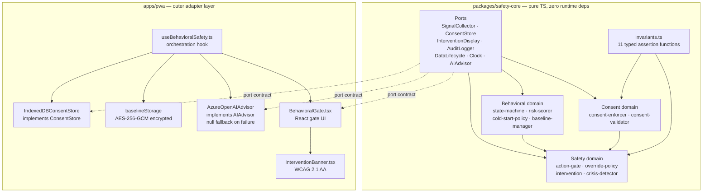
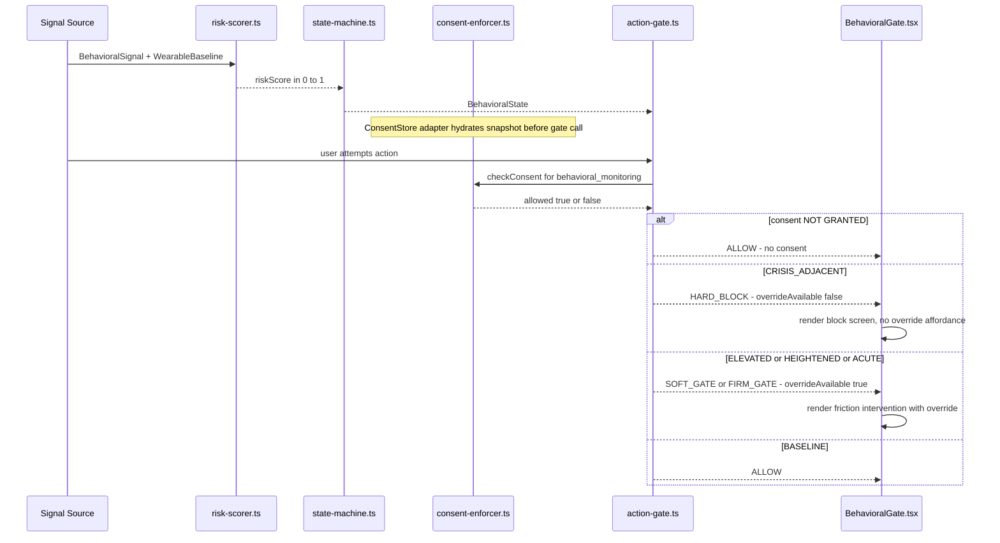
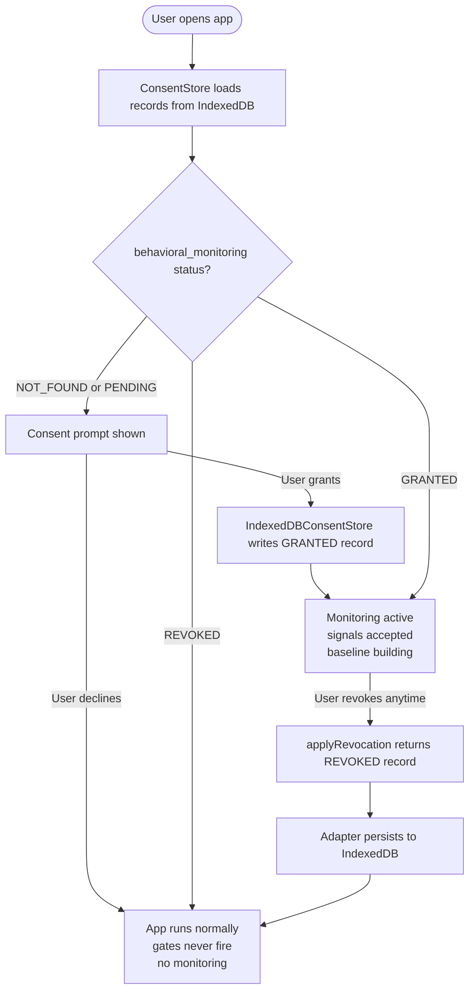
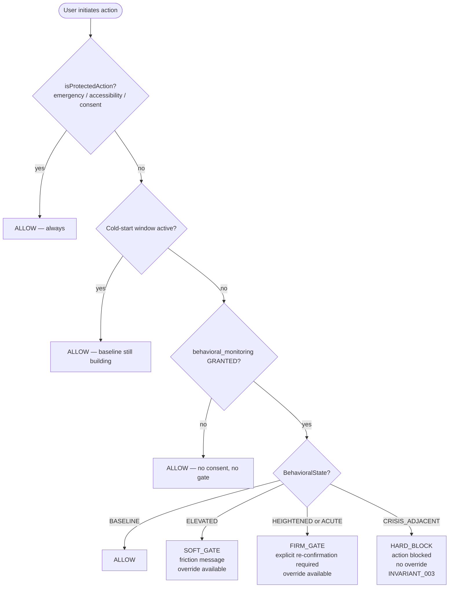

# UICare HUI — Behavioral Safety System

**A fail-safe Progressive Web App for high-risk neurodivergent users.**

This is a behavioral safety aid. It is not a medical device. It does not diagnose
conditions. It does not replace emergency services or clinical support.

---

## What it does for you

**User A — bipolar, hypomanic episodes**

You set it up once. You tell it you want it to watch for your patterns. It learns
what your normal looks like: your resting heart rate range, your usual sleep, your
typical activity level, how much you type in a session. That is your baseline. It
lives on your device, encrypted, never transmitted.

On a Tuesday at 2am you are awake, heart rate elevated, you have typed 4,000 words
in the last hour, you slept three hours last night. You open your banking app and
start moving money. The system has been watching all of this. Your risk score is
above threshold. Before the transfer completes, it stops you — not with a diagnosis,
not with an alarm — with a single screen that says: we noticed a pattern. Take a
breath. You can still do this, but not right now.

At CRISIS_ADJACENT there is no override. The button does not exist. That is the
point.

When your numbers come back down — sleep improves, heart rate drops, you have been
calm for a stretch — the gate lifts on its own. No one unlocks it for you.

**User B — ADHD, compulsive spending, impulsive messaging**

Same system, same consent flow. You opted in. The friction is proportional to where
your signals are. At ELEVATED you get a soft message, a pause. At HEIGHTENED you
confirm. At ACUTE you confirm again. You still have agency at every level except
the top. The system is not trying to control you. It is trying to give you the two
seconds your neurology sometimes does not.

You can revoke consent at any time. One tap. Monitoring stops immediately. No delay,
no grace period. Your data stays on your device.

---

## Why this exists

The moments when a person is most likely to take a catastrophic action — large
financial transfers, relationship-ending messages, irreversible deletions — are
precisely the moments their judgment is most impaired and their self-awareness lowest.
Existing software has no concept of this. It executes.

This system interposes proportional friction at the decision point before the action
completes. It operates offline. It requires consent. It does not claim clinical
authority. It does not remove agency — only slows it.

---

## Mechanism

**Signal collection**
The `SignalCollector` port accepts typed behavioral signals: heart rate delta, sleep
deficit delta, activity level delta, and recent text volume. These are relative to the
user's own rolling baseline, not population norms.

**Baseline management**
`updateBaseline()` in `risk-scorer.ts` uses Welford's online algorithm to maintain a
running mean across all three physiological dimensions. Updates are immutable: the
function returns a new baseline object, never mutates in place.

**Risk scoring**
`computeRiskScore()` produces a composite 0–1 score. Below 3 samples it returns 0.0 —
cold-start uncertainty is explicit. Above that threshold:

```
heartRate contribution  = max(0, hrDelta - baseline.hr)    x 0.33
sleep contribution      = max(0, sleepDelta - baseline.sleep) x 0.34
activity contribution   = max(0, activityDelta - baseline.activity) x 0.33
text volume overlay     = min(0.10, textVolumeRecent / 50000)
```

Weights are heuristics for personal deviation, not validated clinical thresholds.

**State machine**
`transitionState()` maps risk score to one of five behavioral states with hysteresis
(0.08) to prevent flapping. Downward transitions step one level at a time. The state
machine is a pure function: same score + same current state = same output, every time.

```
State             Threshold   Gate imposed   Override
BASELINE          < 0.25      ALLOW          n/a
ELEVATED          >= 0.25     SOFT_GATE      yes
HEIGHTENED        >= 0.50     FIRM_GATE      yes
ACUTE             >= 0.70     FIRM_GATE      yes
CRISIS_ADJACENT   >= 0.85     HARD_BLOCK     NO
```

**Action gate**
`evaluateGate()` checks four rules in order:

1. Protected action (emergency exit, accessibility, consent flow) → ALLOW always.
2. Cold-start window active → ALLOW, gates suppressed while baseline builds.
3. Consent not GRANTED → ALLOW, no gate without consent.
4. Apply STATE_GATE_MAP.

HARD_BLOCK has `overrideAvailable: false`. There is no code path that converts it
to ALLOW. This is INVARIANT_003 and it is tested.

**Consent enforcement**
`checkConsent()` operates on pre-loaded consent records. It never touches storage.
If `behavioral_monitoring` is not GRANTED in the snapshot, gates do not fire.
`applyRevocation()` returns a new record with REVOKED status. There is no grace
period, no retry.

---

## Architecture

Hexagonal (ports and adapters). The innermost hexagon is `packages/safety-core`:
pure TypeScript, zero runtime dependencies. Every external concern — storage, UI,
AI, clock — is a port interface. The PWA implements those ports as concrete adapters.



Dependency direction is inward only. `safety-core` never imports from `apps/*`
or any package that brings in React or browser APIs. Enforced by ESLint boundary
rules at `.eslintrc.boundaries.js`. A violation blocks merge.

---

## Behavioral signal flow



---

## Consent flow



---

## Gate decision logic



---

## Offline-first and AI failure

Cloud AI is an adapter. The `AIAdvisor` port returns `Promise<AIAdvisory | null>`.
When the network is down or the API fails, the adapter returns `null`. The core
falls through to local gate logic. HARD_BLOCK is still HARD_BLOCK. No gate is
disabled by AI failure. This is INVARIANT_009, tested with a null adapter.

---

## Monorepo structure

```
uicare-hui/
├── packages/
│   └── safety-core/           Pure TypeScript. Zero runtime deps.
│       ├── src/
│       │   ├── ports/         SignalCollector, ConsentStore, InterventionDisplay,
│       │   │                  AuditLogger, DataLifecycle, Clock, AIAdvisor
│       │   ├── behavioral/    state-machine, risk-scorer, cold-start-policy,
│       │   │                  feedback-classifier, baseline-manager
│       │   ├── safety/        action-gate, override-policy, intervention,
│       │   │                  agency-preservation, crisis-detector
│       │   ├── consent/       consent-enforcer, consent-validator
│       │   ├── invariants.ts  11 typed assertion functions
│       │   └── index.ts       public API
│       └── tests/             57 unit tests, no DOM, no stubs
├── apps/
│   ├── pwa/                   Next.js 14. Outer adapter layer.
│   │   └── src/
│   │       ├── adapters/      IndexedDBConsentStore, baselineStorage (AES-256-GCM),
│   │       │                  AzureOpenAIAdvisor (null on failure)
│   │       ├── components/    BehavioralGate.tsx, InterventionBanner.tsx
│   │       └── lib/           useBehavioralSafety.ts, encryption.ts
│   └── experimental-tools/   Isolated Python tooling. No production dependency.
├── tests/
│   └── governance/            15 invariant integration tests
├── .github/workflows/ci.yml   5-job pipeline
├── .eslintrc.boundaries.js    INVARIANT_011 enforcement
└── STATUS.json                gateStatus: APPROVED
```

---

## Invariants

All 11 are typed assertion functions in `src/invariants.ts`. They throw. They are
exercised in the test suite.

| ID   | Invariant                                              | Enforcement                    |
|------|--------------------------------------------------------|--------------------------------|
| I001 | Monitoring requires consent status GRANTED             | checkConsent() + test          |
| I002 | Risk score always in [0, 1]                            | computeRiskScore() + test      |
| I003 | CRISIS_ADJACENT maps to HARD_BLOCK, no override        | evaluateGate() + test          |
| I004 | Gate decision is deterministic given same inputs       | pure function + test           |
| I005 | Cold-start suppresses FIRM and HARD gates              | evaluateGate() rule 2 + test   |
| I006 | Consent revocation takes effect immediately            | applyRevocation() + test       |
| I007 | Audit log entries are immutable once written           | AuditLogger port contract      |
| I008 | No clinical language in user-facing copy               | copy audit gate                |
| I009 | AI failure does not disable local gates                | null adapter test              |
| I010 | Data lifecycle requires explicit user authorization    | DataLifecycle port contract    |
| I011 | safety-core has zero runtime dependencies              | ESLint CI boundary check       |

---

## Tests

```
packages/safety-core
  consent-enforcer.test.ts      7 tests
  risk-scorer.test.ts           7 tests
  action-gate.test.ts           9 tests
  state-machine.test.ts        10 tests
  invariants.test.ts           24 tests

tests/governance
  invariants.test.ts           15 tests

Total: 72 passing. No browser stubs.
```

Coverage thresholds: 80% branches, 80% functions, 80% lines on `packages/safety-core`.

---

## Running it

```
git clone https://github.com/coreyalejandro/uicare-hui
cd uicare-hui
npm install
```

```
cd packages/safety-core && npx vitest run
```

```
npm run lint:boundaries
```

```
cd apps/pwa && npm run build
```

---

## Status

- Build contract: CRSP-UICARE-HUI-001
- Governance: The Living Constitution, Satellite topology
- Gate status: APPROVED — all 6 specification documents signed off 2026-05-07
- CI: lint:boundaries blocks merge on any boundary violation
- Not deployed. Build verified locally. Deploy blocked pending signal adapter
  acceptance tests.

---

## Scope boundary

This system does not diagnose any condition. It does not qualify as a medical device.
It does not replace emergency services, clinical support, or crisis intervention.
It does not guarantee prevention of any specific harm.

The user consents to monitoring, revokes it in one tap with immediate effect, and
retains the ability to override all gates except HARD_BLOCK.
