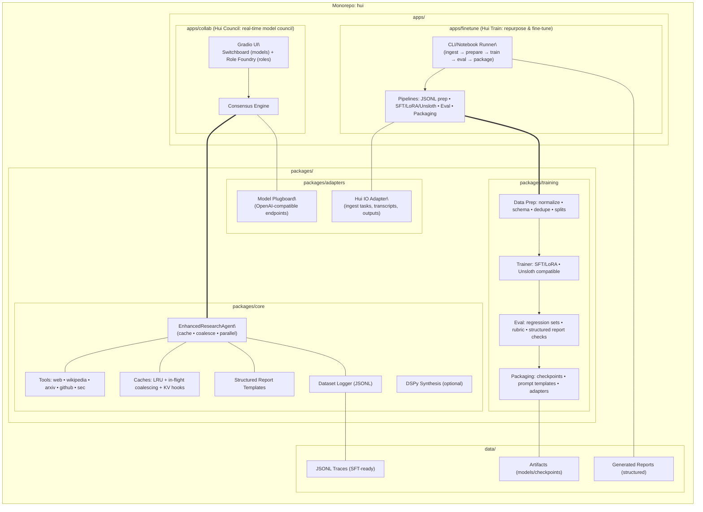

# Hui Adapters (packages/adapters)

Adapters: Plugboard (OpenAI-compatible endpoints), invoker, IO adapters.

## Architecture (signature)

```mermaid
flowchart TB
  subgraph "Monorepo: hui"
    direction TB
    subgraph apps["apps/"]
      direction LR
      subgraph collab["apps/collab (Hui Council: real-time model council)"]
        direction TB
        UI["Gradio UI\\nSwitchboard (models) + Role Foundry (roles)"]
        VCE["Consensus Engine"]
        UI --> VCE
      end
      subgraph finetune["apps/finetune (Hui Train: repurpose & fine-tune)"]
        direction TB
        CLUI["CLI/Notebook Runner\\n(ingest → prepare → train → eval → package)"]
        Pipelines["Pipelines: JSONL prep • SFT/LoRA/Unsloth • Eval • Packaging"]
        CLUI --> Pipelines
      end
    end

    subgraph packages["packages/"]
      direction LR
      subgraph core["packages/core"]
        direction TB
        RA["EnhancedResearchAgent\\n(cache • coalesce • parallel)"]
        Tools["Tools: web • wikipedia • arxiv • github • sec"]
        Cache["Caches: LRU + in-flight coalescing + KV hooks"]
        DSPy["DSPy Synthesis (optional)"]
        Reports["Structured Report Templates"]
        Logger["Dataset Logger (JSONL)"]
        RA --- Tools
        RA --- Cache
        RA --- Reports
        RA --- Logger
        VCE === RA
      end
      subgraph adapters["packages/adapters"]
        direction TB
        Plug["Model Plugboard\\n(OpenAI-compatible endpoints)"]
        HuiIO["Hui IO Adapter\\n(ingest tasks, transcripts, outputs)"]
        VCE --- Plug
        Pipelines --- HuiIO
      end
      subgraph training["packages/training"]
        direction TB
        Prep["Data Prep: normalize • schema • dedupe • splits"]
        Train["Trainer: SFT/LoRA • Unsloth compatible"]
        Eval["Eval: regression sets • rubric • structured report checks"]
        Pack["Packaging: checkpoints • prompt templates • adapters"]
        Pipelines === Prep
        Prep --> Train --> Eval --> Pack
      end
    end

    subgraph data["data/"]
      direction TB
      JSONL["JSONL Traces (SFT-ready)"]
      Artifacts["Artifacts (models/checkpoints)"]
      ReportsOut["Generated Reports (structured)"]
      Logger --- JSONL
      Pack --- Artifacts
      CLUI --- ReportsOut
    end
  end
```
